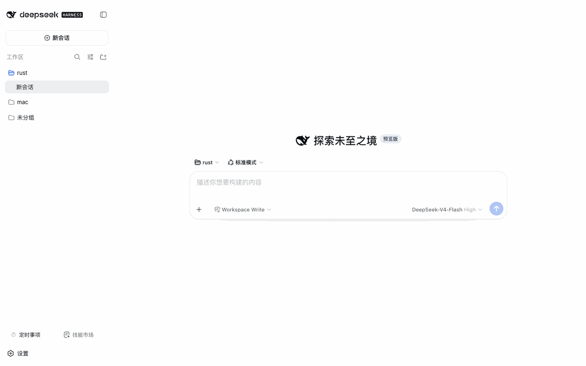

# @weibaohui/hermes-loop

[](https://github.com/topics/dsh-plugin)
[](https://www.npmjs.com/package/@weibaohui/hermes-loop)

**自动复盘插件**：对话收尾后自动复盘，把有价值的经验蒸馏成可复用的技能（skill），把值得长期记住的事实与偏好写入跨会话记忆。



## 核心功能

- **自动复盘**：对话达到阈值（默认 10 轮或 10 次工具调用）且过了冷却期，自动触发一次复盘；结论回显到来源会话
- **经验 → 技能**：复盘产出的经验自动写成 skill 存入技能库，模型之后可以直接调用
- **信号加速触发**：用户中断、工具连续失败、纠正词命中时跳过阈值提前复盘；纠正词可在面板自定义，命中率有统计
- **手动「立即复盘」**：面板一键触发，运行过程实时可见
- **三种模式**：自动写入 / 写入前需审批 / 仅记录不写入，设置面板即时切换
- **技能治理**：技能使用统计、僵尸技能识别；Curator 自动维护技能库（活跃 → 归档 → 可恢复，永不直接删除）
- **跨会话记忆**：复盘按需把环境/项目事实、约定教训写入 `~/.dsh/memory/MEMORY.md`，把用户画像与偏好写入 `USER.md`（对齐 Hermes 的记忆分层）；记忆全文以会话首冻结方式注入每个对话，写入或手改后下个会话生效。按需产出——多数复盘不产生记忆，不为写而写

## 安装

```bash
dsh plugin --profile web add @weibaohui/hermes-loop -w
```

装完重启 `dsh web` 即生效。

## 使用

1. 打开 Web UI → **设置页 → hermes-loop** 面板
2. 默认自动模式即可工作；想更稳妥可切换为「审批」模式（复盘写入前需你确认）
3. 触发阈值、冷却时间、纠正词表均可在面板调整
4. 复盘产出的技能进入技能库后，模型通过 `skill` 工具直接使用；使用统计与归档管理也在面板里
5. 记忆条目在面板查看用量与内容；增删改直接编辑 `~/.dsh/memory/MEMORY.md` / `USER.md`（一行一条、`§ ` 开头），下个会话生效
